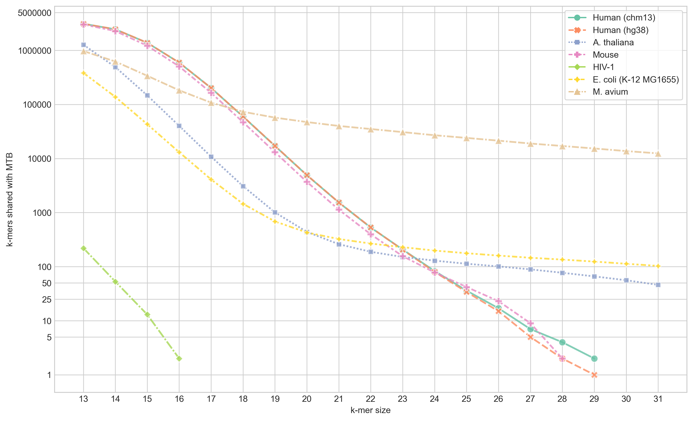
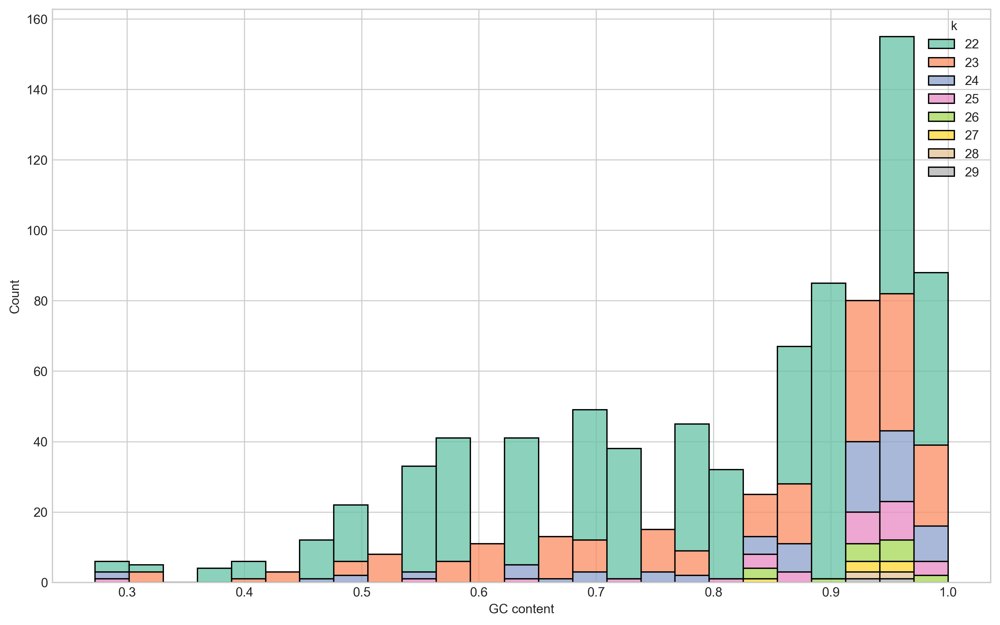

---
authors:
- admin
date: '2023-06-21T00:00:00Z'
tags:
- bioinformatics
- shared-sequence
- kmers
- tuberculosis
- human
title: Searching for shared sequence between Mycobacterium tuberculosis and Homo sapiens
---

[TOC]: #

# Table of Contents
- [Motivation](#motivation)
- [Shared *k*-mer content](#shared-k-mer-content)
- [Aligning reads](#aligning-reads)
- [Summary](#summary)
- [References](#references)

# Motivation

We are in the early stages of planning a *Mycobacterium tuberculosis* (MTB) analysis pipeline for a research project in Papua New Guinea. We'll be sequencing sputum samples with Oxford Nanopore Technologies (ONT) devices and were thinking of different ways of decontaminating the data - i.e. remove anything non-MTB. Sputum samples traditionally have a lot of host (human) reads and reads from a variety of bacteria. Traditionally the MTB component is quite small1. One component of this pipeline will be to upload sequencing reads to a remote/cloud server, so any reduction in file size will make uploads faster. As human reads are not used in any analysis steps, and will need to be removed prior to making any data available, we thought we could simplify things by removing human data as the first step. Our idea was to align reads to the human genome and just remove anything that aligns. However, one concern with this approach was whether any MTB reads could be lost in the process. This effectively boils down to the question: **Do _Mycobacterium tuberculosis_ and _Homo sapiens_ share genomic sequence**? After a literature search, I was unable to find an answer - which seemed quite surprising. My suspicion is that most people just assume they do not. (Or my literature searching skills are poor.) So let's take a look.

# Shared *k*-mer content

The first thing I thought to check was whether there are shared *k*-mers between the two reference genomes for MTB and human. As an aside, after struggling to install/run multiple tools for this job I wrote a simple Rust program - [`skc`][skc] - to do this comparison.

The human genome used is the [Telomere-to-Telomere (T2T) Consortium CHM13 v2.0 assembly][chm13v2] (accession: [GCA_009914755.4](https://www.ncbi.nlm.nih.gov/assembly/GCA_009914755.4))2. The MTB reference genome used is H37Rv (accession: [NC_000962.3](https://www.ncbi.nlm.nih.gov/nuccore/NC_000962.3))3. In addition to the CHM13 human genome, I looked at the shared *k*-mer content between MTB and a collection of other closely- and distantly-related genomes to give some background expectations. The other genomes are:

- The previous human reference genome [GRCh38.p14 (hg38)](https://www.ncbi.nlm.nih.gov/assembly/GCF_000001405.40/)
- The *Mus musculus* (mouse) reference genome [GRCm39 (mm39)](https://www.ncbi.nlm.nih.gov/assembly/GCF_000001635.27/)
- The *Arabidopsis thaliana* (thale cress) reference genome [TAIR10.1](https://www.ncbi.nlm.nih.gov/assembly/GCF_000001735.4)
- The Human immunodeficiency virus 1 (HIV-1) reference genome [NC_001802.1](https://www.ncbi.nlm.nih.gov/nuccore/NC_001802.1)
- The *Escherichia coli* strain K-12 substr. MG1655 reference genome [ASM584v2](https://www.ncbi.nlm.nih.gov/assembly/GCF_000005845.2/)
- The *Mycobacterium avium subsp. hominissuis* strain OCU889s_P11_4s reference genome [NZ_CP018019.1](https://www.ncbi.nlm.nih.gov/nuccore/NZ_CP018019.1)

I ran `skc` with all *k* from 13 to 31 and plot the number of shared *k*-mers at each *k* for each of the genomes listed above.

From this figure we can see that the largest shared content we get been MTB and human (CHM13) is 29-mers - for which there are 2. Interestingly, there is only one match between hg38 and MTB - meaning one of the matches with CHM13 is in new sequence generated by the T2T consortium. The two matches between MTB and CHM13 are

- [`NC_000962.3:2357258`](https://mycobrowser.epfl.ch/jbrowse/index.html?data=data_mycobrowser%2FM.tuberculosis_H37Rv&loc=NC_000962.3%3A2357235..2357280&tracks=DNA%2CAnnotation&highlight=), which is in the PE_PGRS36 gene, and [`chr20:44924007`](https://genome.ucsc.edu/cgi-bin/hgTracks?db=hub_3671779_hs1&lastVirtModeType=default&lastVirtModeExtraState=&virtModeType=default&virtMode=0&nonVirtPosition=&position=chr20%3A44924002%2D44924011&hgsid=1649864754_k9kpCSJ4SEii1AHLlN9L5tzDJi0Y) which begins at the last base of the PTPRT-207 gene.
- [`NC_000962.3:837317`](https://mycobrowser.epfl.ch/jbrowse/index.html?data=data_mycobrowser%2FM.tuberculosis_H37Rv&loc=NC_000962.3%3A837294..837339&tracks=DNA%2CAnnotation&highlight=), which is in the PE_PGRS9 gene, and [`chrX:86236022`](https://genome.ucsc.edu/cgi-bin/hgTracks?db=hub_3671779_hs1&lastVirtModeType=default&lastVirtModeExtraState=&virtModeType=default&virtMode=0&nonVirtPosition=&position=chrX%3A86236017%2D86236026&hgsid=1649864754_k9kpCSJ4SEii1AHLlN9L5tzDJi0Y), which is in [RP6-43L17.2](https://genome.ucsc.edu/cgi-bin/hgc?hgsid=1649865962_pnhY9tSh3kU7tqDllTU3Pg2qE6iy&db=hg38&c=chrX&l=87808740&r=87808931&o=87807548&t=87809883&g=gtexGeneV8&i=RP6%2D43L17.2) (mitochondrial ribosomal protein S22 pseudogene 1)

Both of these 29-mers also match in soft-masked regions of the CHM13 assembly - indicating they're likely in repeats discovered by the T2T team.

Unsurprisingly, the most 31-mer matches were with *M. avium*, followed by *E. coli*. There are also 46 31-mers that match in the *A. thaliana* genome, which I was quite surprised about initially. But on further inspection, those hits are in the 16S rRNA of the chloroplast.

Next, I looked at the GC content distribution of the matching *k*-mers between MTB and CHM13. This was to convince myself these matches with the human genome were likely due to chance given they come from repetitive regions in both genomes.

The GC content of the MTB genome is ~65%. However, we see that the bulk of the shared *k*-mers (78%) have a GC content over 65% - with 46% being over 90%. Importantly, our two 29-mers have GC content of 93.1% and 96.6%.

<!-- TODO check human vs all other species -->

# Aligning reads

Given the whole point of this analysis was to see if I would lose MTB reads when aligning a sputum sample to just the human genome, it's fair to argue I should have just tested that approach and been done with it. But I can be a little paranoid so I looked at shared *k*-mers first because...well why not?

My main interest for this project was ONT data, so I simulated ONT reads from the MTB reference genome (H37Rv) to 5x depth with [Badread]4. I then aligned these reads to CHM13 with [minimap2](https://github.com/lh3/minimap2)5 (`-x map-ont`), but got no alignments. As the shared *k*-mers I observed were found in repetitive regions, I also tried aligning the MTB reads to CHM13 using [Winnowmap]6, which is designed for aligning long reads to repetitive reference sequences. Still no alignments.

As an additional analysis, as I assume this will be of interest to others, I also checked the alignment of Illumina reads. I simulated paired MTB reads from H37Rv with [ART]7 to a depth of 20x from a HiSeq 2500 (`-ss HS25`) and MiSeq v3 (`-ss MSv3`). I aligned these to CHM13 with minimap2 (`-x sr`) and got a very small number of alignments - 46 reads for HiSeq 2500 and 32 reads from MiSeq v3 (none of these alignments were near where the 29-mer matches are).

# Summary

For my part, I'm pretty happy to conclude that aligning ONT sputum data to the human genome will not remove any MTB reads. Doing the same for Illumina data will result in a negligible number of MTB reads being lost. While there is *some* shared *k*-mers between MTB and the human genome, these are likely repeat artifacts. I'm going to boldly conclude that there **is no shared sequence between _M. tuberculosis_ and _Homo sapiens_** - at least nothing that is evolutionarily meaningful. I would love to be proven wrong though.

# References

1. Nilgiriwala K, Rabodoarivelo M-S, Hall MB, Patel G, Mandal A, Mishra S, et al. Genomic sequencing from sputum for tuberculosis disease diagnosis, lineage determination, and drug susceptibility prediction. J Clin Microbiol. 2023;61: e0157822. doi:[10.1128/jcm.01578-22](https://doi.org/10.1128/jcm.01578-22)
2. Rhie A, Nurk S, Cechova M, Hoyt SJ, Taylor DJ, Altemose N, et al. The complete sequence of a human Y chromosome. bioRxiv. 2022. doi:[10.1101/2022.12.01.518724](https://doi.org/10.1101/2022.12.01.518724)
3. Cole ST, Brosch R, Parkhill J, Garnier T, Churcher C, Harris D, et al. Deciphering the biology of Mycobacterium tuberculosis from the complete genome sequence. Nature. 1998;393: 537–544. doi:[10.1038/31159](https://doi.org/10.1038/31159)
4. Wick R. Badread: simulation of error-prone long reads. J Open Source Softw. 2019;4: 1316. doi:[10.21105/joss.01316](https://doi.org/10.21105/joss.01316)
5. Li H. Minimap2: pairwise alignment for nucleotide sequences. Bioinformatics. 2018;34: 3094–3100. doi:[10.1093/bioinformatics/bty191](https://doi.org/10.1093/bioinformatics/bty191)
6. Jain C, Rhie A, Hansen NF, Koren S, Phillippy AM. Long-read mapping to repetitive reference sequences using Winnowmap2. Nat Methods. 2022;19: 705–710. doi:[10.1038/s41592-022-01457-8](https://doi.org/10.1038/s41592-022-01457-8)
7. Huang W, Li L, Myers JR, Marth GT. ART: a next-generation sequencing read simulator. Bioinformatics. 2012;28: 593–594. doi:[10.1093/bioinformatics/btr708](https://doi.org/10.1093/bioinformatics/btr708)

You can cite this post as 

Hall, Michael B. Searching for shared sequence between Mycobacterium tuberculosis and Homo sapiens. Zenodo; 2023. doi:[10.5281/zenodo.8068147](https://doi.org/10.5281/zenodo.8068146)

[skc]: https://github.com/mbhall88/skc
[chm13v2]: https://github.com/marbl/CHM13#t2t-chm13v20-t2t-chm13y
[Badread]: https://github.com/rrwick/Badread
[Winnowmap]: https://github.com/marbl/Winnowmap
[ART]: https://www.niehs.nih.gov/research/resources/software/biostatistics/art/index.cfm